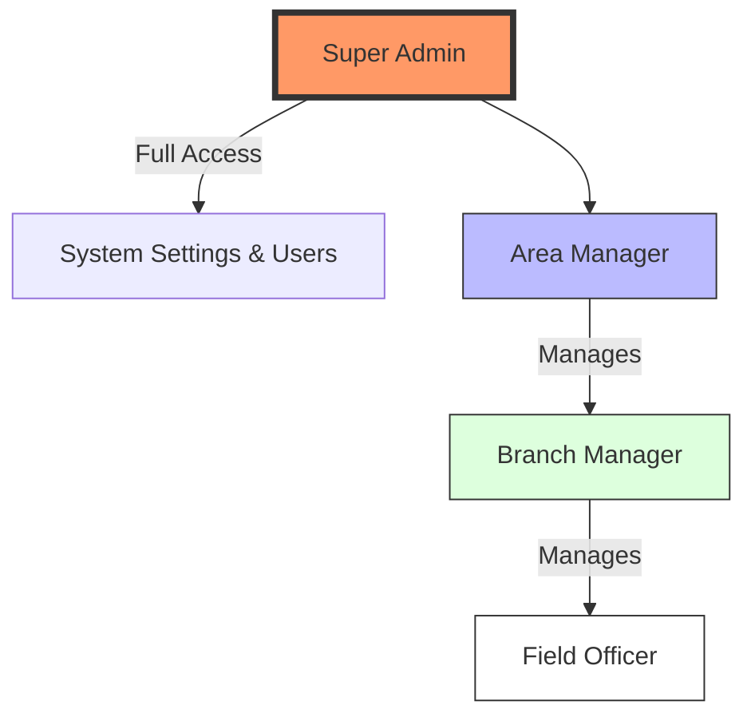
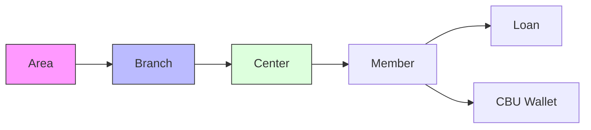

# Alwan KMBI - Web Application

This is the main web application for the Alwan KMBI system, built with Next.js 14, Prisma, and Supabase.

## 🚀 Getting Started

1. **Clone the repository**
2. **Install dependencies**:
   ```bash
   cd alwan-web
   npm install
   ```
3. **Set up Environment Variables**:
   Create a `.env` file based on `.env.example` and fill in your Supabase credentials.
4. **Run Database Migrations**:
   ```bash
   npx prisma db push
   ```
5. **Run the Development Server**:
   ```bash
   npm run dev
   ```

---

## 🏛️ System Hierarchy

### 🔑 1. Role (Access) Hierarchy
The system uses **Role-Based Access Control (RBAC)** to ensure users only see and perform actions appropriate for their position.



| Role | Responsibility | Key Permissions |
| :--- | :--- | :--- |
| **Super Admin** | System Administration | Manage Users, Global Settings, Audit Logs, All Data |
| **Area Manager** | Regional Operations | Approve large loans (>₱20k), View Area Reports |
| **Branch Manager** | Branch Operations | Approve standard loans, Manage Centers, Verify Collections |
| **Field Officer** | Front-line Operations | Create loans, Conduct weekly collections, Member intake |

---

### 🏢 2. Organizational (Data) Hierarchy
How information is structured within the database.



- **Area**: The largest geographic unit (e.g., "NCR South").
- **Branch**: A specific local office (e.g., "Muntinlupa Branch").
- **Center**: A group of members who meet weekly (e.g., "Holy Spirit Center").
- **Member**: An individual client enrolled in the program.
- **Loan**: Financial products issued to members.

---

### 🛡️ 3. Financial Approval Hierarchy
Standardized workflow for loan processing:

1.  **Field Officer**: Submits Loan Application (Draft).
2.  **Branch Manager**: Reviews and Approves loans up to **₱20,000**.
3.  **Area Manager**: Reviews and Approves loans exceeding **₱20,000**.
4.  **Disbursement**: System releases funds once final approval is granted.

---

## 📁 Project Structure

For a detailed breakdown of the project structure, please refer to the documentation in `docs/project-structure.md` (or the brain artifacts).

## 🛠️ Built With
- **Framework**: [Next.js 14](https://nextjs.org/)
- **Database**: [Supabase](https://supabase.com/) & [Prisma](https://www.prisma.io/)
- **State Management**: [Zustand](https://zustand-demo.pmnd.rs/)
- **Styling**: [Tailwind CSS](https://tailwindcss.com/)
- **UI Components**: [Radix UI](https://www.radix-ui.com/) & [Lucide Icons](https://lucide.dev/)
